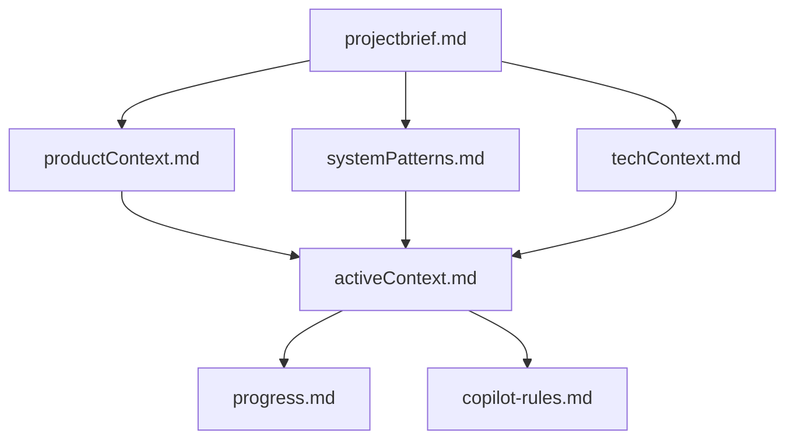
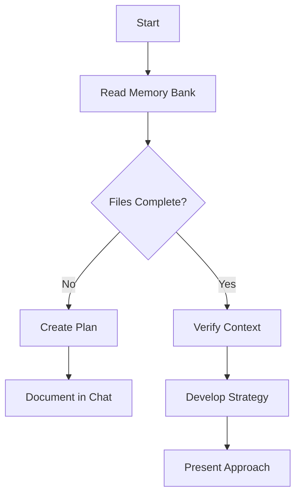
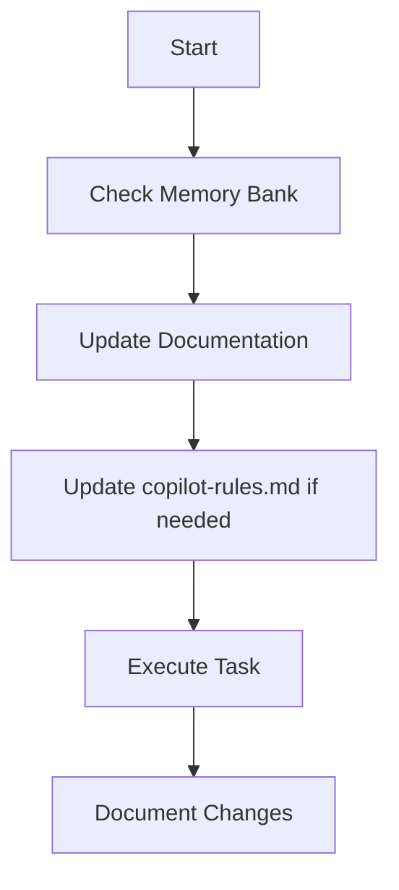
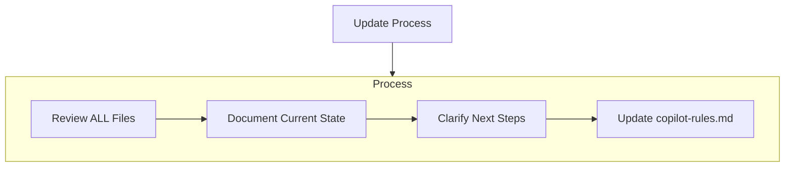

# Copilot Memory Bank & Project Instructions

## Summary

This document defines how GitHub Copilot maintains project memory and context across sessions. Copilot’s memory resets between sessions, so all project knowledge must be captured in the Memory Bank to ensure continuity, accuracy, and effective collaboration.

---

## Core Principle

**Copilot MUST read ALL memory bank files at the start of EVERY task.**

* No exceptions.
* Use this checklist before any work:

  * [ ] Read `projectbrief.md`
  * [ ] Read `productContext.md`
  * [ ] Read `systemPatterns.md`
  * [ ] Read `techContext.md`
  * [ ] Read `activeContext.md`
  * [ ] Read `progress.md`
  * [ ] Read `copilot-rules.md`
  * [ ] Read any additional context files in `/memory-bank/`

---

## Memory Bank Structure

The Memory Bank consists of required core files and optional context files, all in Markdown. Files build upon each other in a clear hierarchy:



### Core Files (Required)

1. **projectbrief.md**
   Foundation document for all others. Defines core requirements, goals, and project scope.
2. **productContext.md**
   Why this project exists, problems it solves, user experience goals.
3. **systemPatterns.md**
   System architecture, key technical decisions, design patterns, component relationships.
4. **techContext.md**
   Technologies used, development setup, technical constraints, dependencies.
5. **activeContext.md**
   Current work focus, recent changes, next steps, active decisions.
6. **progress.md**
   What works, what’s left to build, current status, known issues.
7. **copilot-rules.md**
   Project rules, Copilot guidance, safety/security policies, evolving project patterns.

### Additional Context

Add extra files/folders in `/memory-bank/` for:

* Complex features
* Integration specs
* API docs
* Testing strategies
* Deployment procedures

---

## Core Workflows

### Plan Mode



**Description:**

* Always start by reading all memory bank files.
* If files are missing, create a plan and document it.
* If files are complete, verify context and develop a strategy before acting.

### Act Mode



**Description:**

* Check memory bank before any action.
* Update documentation as you work.
* Update `copilot-rules.md` if new patterns or rules are discovered.
* Document all changes.

---

## Documentation Updates

Update the Memory Bank when:

1. Discovering new project patterns or rules
2. After significant changes
3. When the user requests with **update memory bank** (review ALL files)
4. When context needs clarification



**Note:**
On **update memory bank**, review every file, even if some don’t require changes.
Focus on `activeContext.md` and `progress.md` for current state.

---

## Project Rules (`copilot-rules.md`)

This file is Copilot’s and the team’s learning journal for the project. It captures:

* Critical implementation paths
* User preferences and workflow
* Project-specific patterns
* Security requirements and known challenges
* Evolution of project decisions
* Tool usage patterns

**Example: Core Security Rule**

```markdown
## 🚨 Security: Never Upload Secrets

- Never copy, move, or commit secret files or values (e.g., `.env`, `secrets.json`, API keys, tokens, passwords) to version control or into example/sample config files.
- Example files like `.env.example` must be built by hand with only safe placeholder values.
- Always verify that no secrets are present before staging, committing, or pushing code.
- If a secret is ever committed, treat as a security incident: remove from history and rotate affected credentials immediately.
- Use secret scanning tools (e.g., GitHub Secret Scanning, TruffleHog, git-secrets) for extra safety.
```

---

## How to Use This Document

* Reference this file at the start of every session.
* Use the checklists and diagrams to guide your workflow.
* Update the Memory Bank and `copilot-rules.md` as you learn.
* Treat this as a living document—improve it as the project evolves.

---

**REMEMBER:**
After every memory reset, Copilot begins completely fresh. The Memory Bank is the only link to previous work. Maintain it with precision and clarity—project effectiveness and security depend on its accuracy.

---

# Project Instructions: hashctl

`hashctl` is a standard-library-only Go CLI client for the Hash Engine REST API (CTS manifest jobs and signing). Module: `github.com/adamdost-0/hashctl`. These concrete instructions complement the Memory Bank above; the `/memory-bank/` files hold the durable project knowledge.

## Build, validate, and test (run before every commit/PR)

Everything runs **offline** — `GOPROXY=off GOSUMDB=off` on every Go command (zero third-party deps, no `go.sum`). The four-step gate mirrors `.github/workflows/build-hashctl.yml`:

```bash
./scripts/test-hashctl.sh                                   # CGO_ENABLED=0 GOPROXY=off GOSUMDB=off go test ./...
CGO_ENABLED=0 GOPROXY=off GOSUMDB=off go vet ./...
gofmt -l .                                                  # must print nothing; fix with: gofmt -w .
HASHCTL_VERSION=dev ./scripts/build-hashctl.sh             # writes bin/hashctl (untracked)
```

If installed, also run `golangci-lint run ./...` (config `.golangci.yml`; a `depguard` rule enforces the stdlib-only policy). Single test: `CGO_ENABLED=0 GOPROXY=off GOSUMDB=off go test ./internal/hashctl -run TestName -v`.

## CI gates

A PR fails if any of these fail: `build-hashctl.yml` (test → vet → gofmt → build; gitleaks credential scan; cross-platform packaging), `security.yml` (golangci-lint, govulncheck, dependency-review), `codeql.yml` (CodeQL SAST). Releases are cut by `release.yml` (GoReleaser) from an annotated, signed tag `vX.Y.Z`.

## Architecture

`cmd/hashctl/main.go` is a thin entrypoint calling `hashctl.Run(args, stdout, stderr)`. All logic lives in `internal/hashctl/`: `commands.go` (Run, parseGlobal, dispatch), `client.go` (Client.do, typed errors APIError/TransportError/PollError), `config.go` (resolveConfig precedence + HTTPS guard), `types.go` (exit codes + structs), `output.go` (human/JSON render + redact), `smoke.go`, `help.go`. The `app` struct (stdout/stderr/getenv/httpClient) is the DI seam; tests use `New(...)` with a fake env and an `httptest` client. See `docs/decisions/` (ADRs) and `docs/threat-model.md`.

## Conventions

- **Config precedence:** defaults → `config.json` → env (`HASH_ENGINE_API`, `HASH_ENGINE_BEARER_TOKEN`) → CLI flags (later wins).
- **Global flags precede the command** (`parseGlobal` stops at the first non-flag arg).
- **Exit codes** (`types.go`): 0 success, 2 usage, 3 transport, 4 API 4xx, 5 API 5xx, 6 poll timeout.
- **Security (enforced in code):** literal `--bearer-token` rejected (use `HASH_ENGINE_BEARER_TOKEN` or a `chmod 600` `--bearer-token-file`); bearer refused over non-loopback plaintext `http`; non-loopback API URLs must be `https`; **all output routed through `redact()`**.
- **Output modes:** `--output human|json`; a new result type needs a `writeHuman` case.
- **Versioning:** `VERSION` injected via ldflags into `hashctl.Version`; Semantic Versioning + Conventional Commits; record changes in `CHANGELOG.md`.
- **Tests** use `net/http/httptest`; no external frameworks.

## Do / Do not

**Do:** run the validation gate before committing; keep stdlib-only and offline; route user-facing strings through `redact()`; capture durable learnings in the Memory Bank and via `store_memory`.

**Do not:** add `require` entries to `go.mod` or a `go.sum`; accept a literal `--bearer-token`; emit secrets unredacted; commit `bin/`, `artifacts/`, `dist/`, or live credentials.
