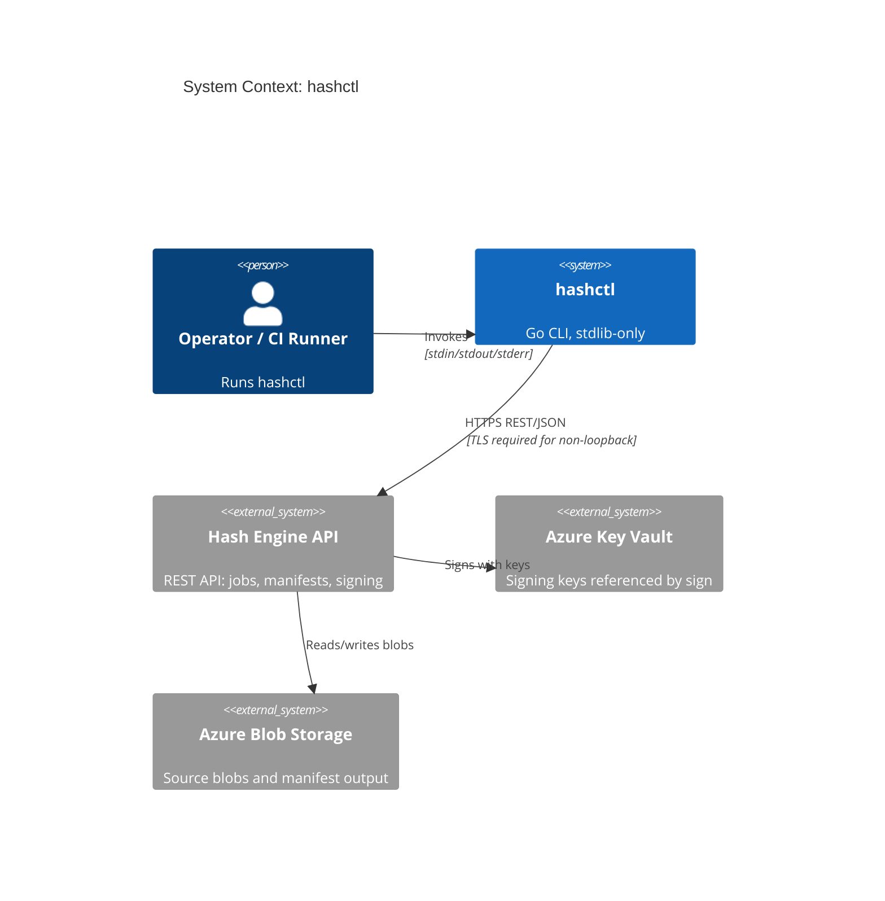

# Threat Model: hashctl

This document is the design-phase security artifact for `hashctl`, following the four
[OWASP threat-modeling questions](https://owasp.org/www-community/Threat_Modeling):
*What are we building? What can go wrong? What are we going to do about it? Did we do a
good job?* It is versioned with the code and should be revisited when commands, transport,
or credential handling change.

## 1. What are we building?

`hashctl` is a standard-library-only Go CLI that authenticates to the Hash Engine REST API
to manage CTS manifest hashing jobs and signing. It handles bearer tokens (JWTs), Azure
SAS query parameters, and storage `AccountKey=` values.

**Trust boundary:** the primary boundary is between the local operator environment and the
remote Hash Engine API. The main asset to protect is the **bearer token / credentials**;
the main loss event is **credential disclosure**.

## 2–3. What can go wrong, and what we do about it (STRIDE)

| STRIDE | Threat scenario | Mitigation in `hashctl` | Residual risk / follow-up |
|---|---|---|---|
| **Spoofing** | Bearer token stolen from a world-readable file | Tokens come only from `HASH_ENGINE_BEARER_TOKEN` or a `--bearer-token-file` whose permissions must be `0600`; the literal `--bearer-token` flag is rejected (`config.go`, `commands.go`) | Token still lives in process memory/env; out of scope for a CLI |
| **Spoofing** | MITM intercepts credentials over plaintext HTTP | Non-loopback API URLs must use HTTPS; bearer tokens are refused over non-loopback HTTP (ADR-0004) | Server TLS/cert validation is the platform's responsibility |
| **Tampering** | API response altered in transit | Transport integrity via TLS | No client-side response signature check (acceptable under HTTPS) |
| **Repudiation** | Unclear who created or signed a job | Per-request `x-correlation-id`; `SignerObjectID` returned by the API | Correlation IDs should surface in server-side audit logs |
| **Information disclosure** | Secrets leak into stdout/stderr/CI logs | All output and errors routed through `redact()` — JWTs, SAS params, `AccountKey=`, high-entropy tokens (ADR-0003); CI gitleaks scan | Any new output path must call `redact()` (review-enforced) |
| **Denial of service** | A poll loop hangs indefinitely | `--timeout` on requests and `--poll-timeout` (default 10m) with `ctx` cancellation (`client.go`) | Consider a separate overall command deadline |
| **Elevation of privilege** | `x-hash-engine-local-*` headers misused in production | Local-auth headers are sent only when explicitly supplied via flags; production uses bearer tokens | Document that local-principal flags are for dev/smoke only |

## 4. Did we do a good job?

Mitigations are enforced **in code** (not only policy) and covered by tests:

- `output_test.go` — redaction patterns.
- `commands_test.go` — token-file permission rejection, HTTPS enforcement, literal-token
  rejection, exit-code mapping.
- CI — gitleaks credential scan, `gosec`, `govulncheck`, and CodeQL SAST.

Open items are tracked in the residual-risk column above and revisited whenever the
transport, credential handling, or command surface changes.
